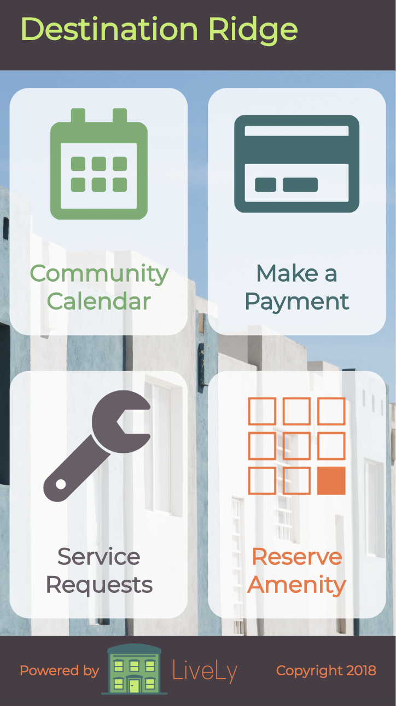

# LiveLy - Your Apartment Management Portal

## See the App
Check out LiveLy at https://lively.surge.sh.
* To see the admin experience, use the last name "admin" and the PIN "12345"
* To see the resident experience, use the last name "resident" and the PIN "12345"

Note: The server goes to sleep after periods of inactivity, so it may take longer than expected when initially validating credentials. Thanks for your patience!

## See the Code
* [Client](https://github.com/mjschreier1/lively-client)
* [Server](https://github.com/mjschreier1/lively-server)

## The Pitch
I have lived in apartments for the last ten years across a few different states. I've noticed that apartment portals (where they exist) are often clunky and do not render well on mobile devices. Further, they often could stand an upgrade to the UX design. Others I've spoken with have echoed this problem. LiveLy seeks to disrupt that norm.

LiveLy is a community calendar, a service request portal, a conference room reservation desk, and a resident payment portal. 

## LiveLy Mobile View

## Technologies
Angular 6, Stripe, Java, Spring Boot, PostgreSQL, Cypress

## Features Still in Development
* Amenity Reservation

## Run the Project Locally
Fork and clone [the client repository](https://github.com/mjschreier1/lively-client) on your local machine, then run `ng serve` from the root of that directory. Open your browser to http://localhost:4200 to see it in action! Note that some elements and features, such as fonts and payments will not work properly without an internet connection.

## License
MIT

## Contact
mjschreier1@gmail.com